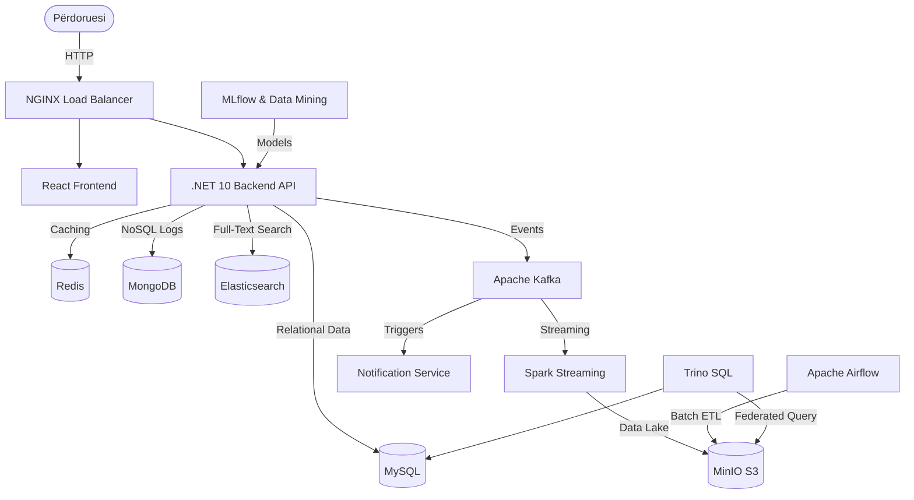

# Healthhub: Enterprise Data & Microservices Platform 🏥🚀


Mirësevini në depozitën qendrore (Monorepo) të **Healthhub** – një sistem spitalor inteligjent dhe plotësisht i shkallëzuar. Ky projekt është dizenjuar sipas standardeve më të larta të industrisë duke përfshirë *Microservices, Data Lakehouses, Machine Learning, dhe SRE/DevOps*.

## 🏗️ Arkitektura e Sistemit

Sistemi përbëhet nga disa shtresa të decentralizuara që komunikojnë përmes Event-Driven Architecture (Kafka) dhe kërkesave REST.



## 🛠️ Teknologjitë (Tech Stack)

| Kategoria | Teknologjitë |
| :--- | :--- |
| **Frontend** | React, Vite, MDB Bootstrap |
| **Backend API** | C# .NET 10, Entity Framework Core, Polly |
| **Baza të Dhënave** | MySQL 8.0, MongoDB 6.0, Redis |
| **Data Engineering** | Apache Kafka, Apache Spark, Apache Airflow, MinIO (S3), Trino |
| **Siguria (IAM)** | Keycloak (OAuth2/OpenID), HashiCorp Vault |
| **Analitika & ML** | MLflow, Scikit-Learn, Elasticsearch, Grafana, Kibana |
| **DevOps & SRE** | Docker Compose, Terraform, GitHub Actions, Jaeger (OpenTelemetry) |

## 📂 Struktura e Projektit

```text
/Healthhub
├── /ReactApp1.Server       # Backend API (.NET 10)
├── /reactapp1.client       # Frontend Web (React)
├── /config                 # Konfigurimet (Prometheus, NGINX)
├── /docs                   # Dokumentacioni, AsyncAPI, dhe SRE Runbooks
├── /infrastructure         # Skriptet e Infrastrukturës (Terraform, Chaos Mesh)
├── /machine_learning       # Skriptet e Inteligjencës Artificiale (MLflow)
├── /services               # Mikrokode shtesë (Njoftimet)
├── /airflow                # Skriptet ETL për të dhënat (DAGs)
├── /data-quality           # Rregullat e Data Quality (Great Expectations)
├── /spark                  # Procesimi real-time
└── docker-compose.yml      # Orkestrimi i 15+ kontejnerëve
```

## 🚀 Si ta ndezim projektin?

1. **Ndiz Infrastrukturën:** Hapni terminalin dhe ngrijeni të gjithë sistemin përmes Docker. Kjo do të ndezë të gjitha databazat, Kafka, dhe shërbimet e sigurisë.
   ```bash
   docker-compose up -d
   ```
2. **Ndiz Backend (.NET):** 
   ```bash
   cd ReactApp1.Server
   dotnet run
   ```
3. **Ndiz Frontend (React):** 
   ```bash
   cd reactapp1.client
   npm run dev
   ```

## 🛡️ Rregullat e Zhvillimit
Para se të dërgoni kod të ri, ju lutemi lexoni skedarin `CONTRIBUTING.md` në dosjen `/docs` për rregullat tona rreth *GitOps*, *SemVer*, dhe *Pair Programming*. Kodi juaj do të skanohet automatikisht nga SonarQube dhe GitHub Actions.
